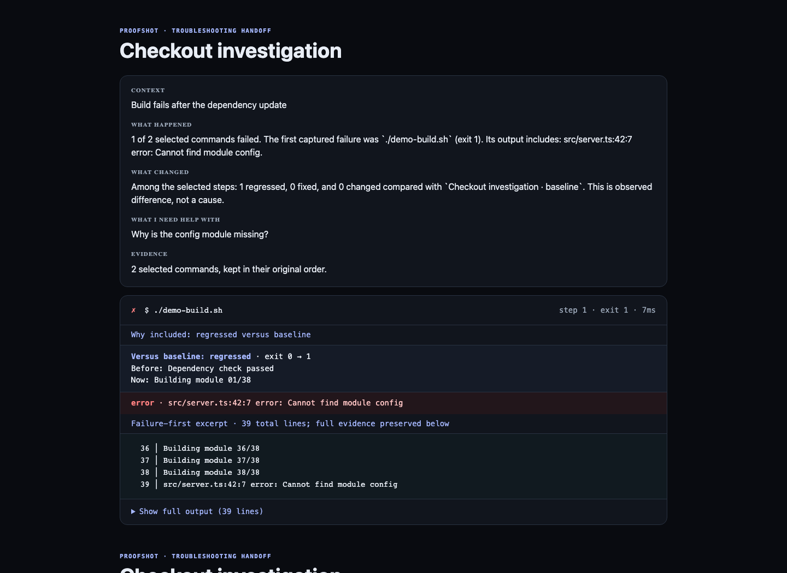
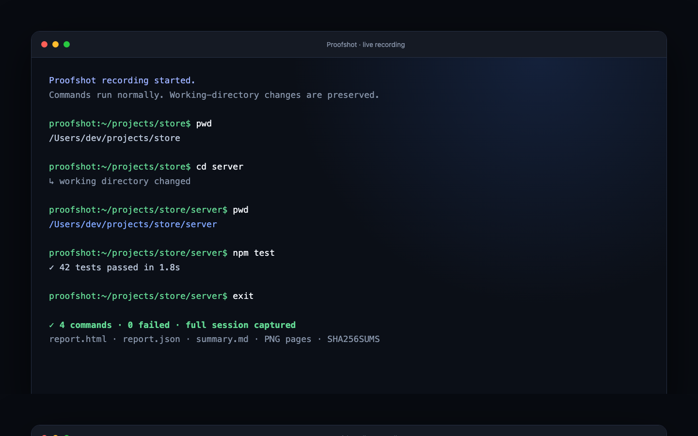
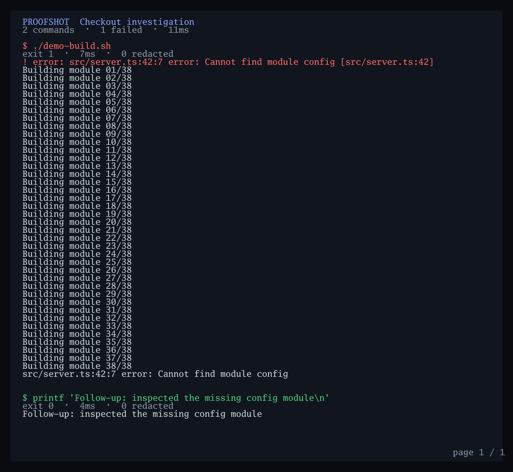
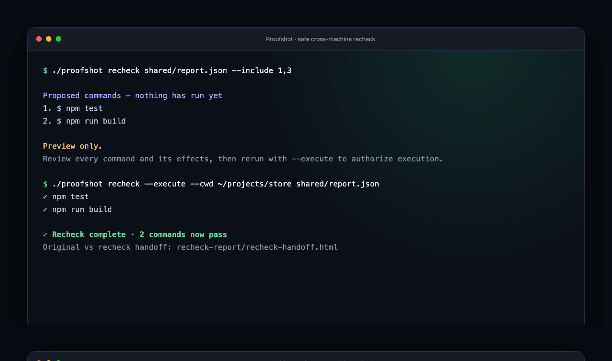
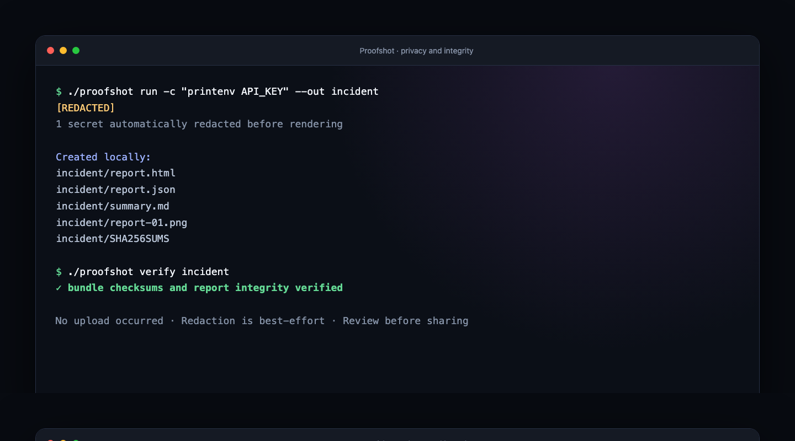

# Proofshot

Proofshot turns a messy series of terminal commands into a useful troubleshooting handoff. Record the commands and their output, choose the evidence that matters, and send a single HTML file that explains what failed. Long logs open near the diagnostic without discarding the full output.

No account or upload is required. Reports are generated locally.

<p align="center">
  
</p>

<p align="center"><strong>Record → isolate the failure → share one file → recheck anywhere.</strong></p>

| Record the real session | Find the signal | Share useful evidence | Recheck safely |
| --- | --- | --- | --- |
| Commands, output, timing, and working directories | Failure-first excerpts and baseline regressions | One private, portable HTML handoff | Preview first, then explicitly opt in to execute |

## Quickstart

Requires Go 1.24 or newer. Build from this directory:

```sh
go build -o proofshot .
```

Start a recording, work normally, then type `exit` or press Ctrl-D:

```sh
./proofshot record --title "Checkout investigation" --out checkout-session

proofshot:~/projects/app$ npm test
proofshot:~/projects/app$ git status
proofshot:~/projects/app$ exit
```

The prompt shows the current working directory; `cd` changes persist between commands. Output appears live while Proofshot captures command boundaries, exit codes, durations, and failure findings.



Review the suggested evidence and make a handoff:

```sh
./proofshot share --suggest checkout-session/report.json
./proofshot share \
  --context "Checkout broke after updating dependencies" \
  --question "Which failing step should we investigate first?" \
  --out checkout-handoff.html \
  checkout-session/report.json
```

Open `checkout-handoff.html`, review it for sensitive information, then send that one file. Proofshot does not upload it. By default, the handoff suggests failed commands, the preceding step, and the first successful step afterward. `--include 1,3-5` selects steps manually; `--all` includes everything.

## What recipients get

- A short, factual account of the selected results and why each command was included.
- The command, exit code, runtime, likely diagnostic, and its output.
- For long output, a numbered excerpt around the diagnostic plus a **Show full output** control. The full evidence is never dropped.
- A privacy warning for potentially identifying content; automatic secret redaction runs again on the title, command text, and output.

Suggestions are deterministic heuristics, not an AI diagnosis. A preceding command is sequence context, not a proven cause.

### Full evidence, never cut off

Proofshot also renders long terminal output as numbered image pages. Recipients can scan the complete run without relying on a cropped screenshot or losing the lines around a failure.



## Compare two runs

If a check passed before but fails now, attach the earlier report:

```sh
./proofshot share \
  --baseline baseline/report.json \
  --question "Why does this fail now?" \
  --out regression-handoff.html \
  current/report.json
```

Proofshot prioritizes regressions and changed output. The handoff shows earlier/current exit codes and the first differing output line. Repeated commands are matched in occurrence order. Differences are observations, not claims about root cause.

## Recheck on another machine

A recipient who has the project can preview the proposed commands without running them:

```sh
./proofshot recheck shared/report.json
```

After inspecting every command and choosing an appropriate working directory, they may explicitly opt in:

```sh
./proofshot recheck \
  --include 1,3 \
  --cwd /path/to/project \
  --out my-recheck \
  --execute \
  shared/report.json
```

The result includes `my-recheck/recheck-handoff.html`, comparing those checks with the sender's run. Recheck refuses commands containing redacted secrets and `cd` steps. **Shared commands may have side effects.** Reports have checksums but no identity signature; accept them only from a trusted sender and inspect the preview before using `--execute`.



## Other commands

Run a known series without entering an interactive session:

```sh
./proofshot run -c "npm test" -c "npm run build" --out release-check
```

Turn existing logs into a report without executing them:

```sh
./proofshot render --title "Incident output" --out incident app.log worker.log
```

Compare two report JSON files as Markdown:

```sh
./proofshot compare --out comparison.md baseline/report.json current/report.json
```

Verify a newly generated bundle:

```sh
./proofshot verify checkout-session
```

An ordinary bundle contains `report.html`, `report.json`, `summary.md`, `SHA256SUMS`, and numbered `report-01.png` pages. Recheck bundles also include `recheck-handoff.html` in the checksum manifest. Older bundles created before checksums were added cannot be verified with this command.



## Safety and limitations

- Redaction is best-effort. Always inspect HTML, images, Markdown, and JSON before sharing; secrets or private paths may still appear.
- The checksum manifest detects modified artifacts when the manifest is trusted. It does **not** prove who created a report and can be regenerated by an attacker.
- `record` is command-oriented, not a full PTY. Full-screen applications and interactive password prompts are not supported in this MVP.
- `run` and `record` execute shell commands. `render`, `share`, `compare`, and `verify` do not. `recheck` only executes with `--execute`.
- Nothing is hosted or uploaded by Proofshot today.

## Development

```sh
go test ./...
go vet ./...
go build -o proofshot .
```

## License

Copyright retained. A license has not been chosen yet.
